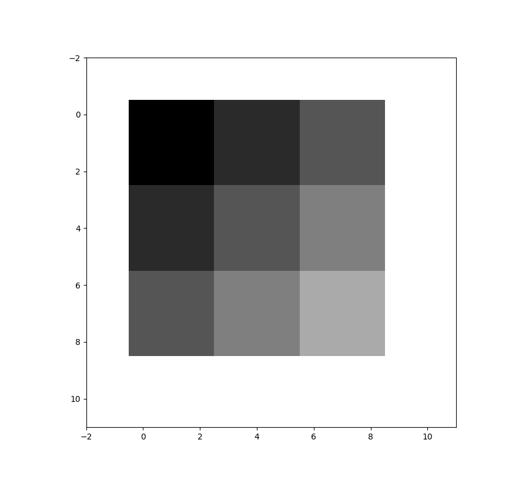
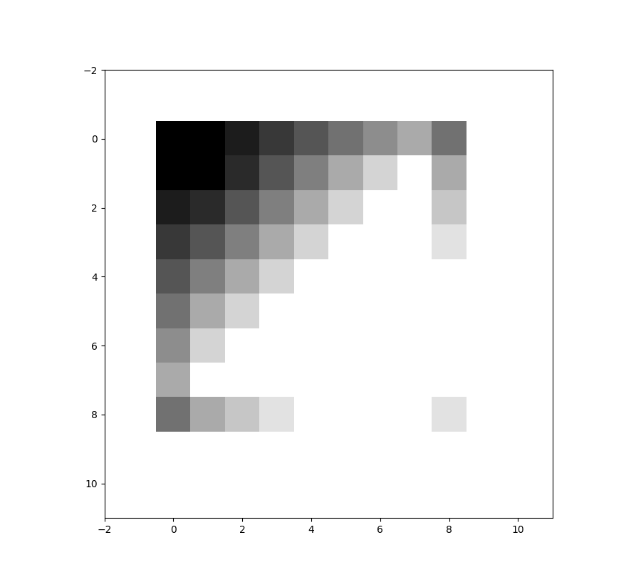
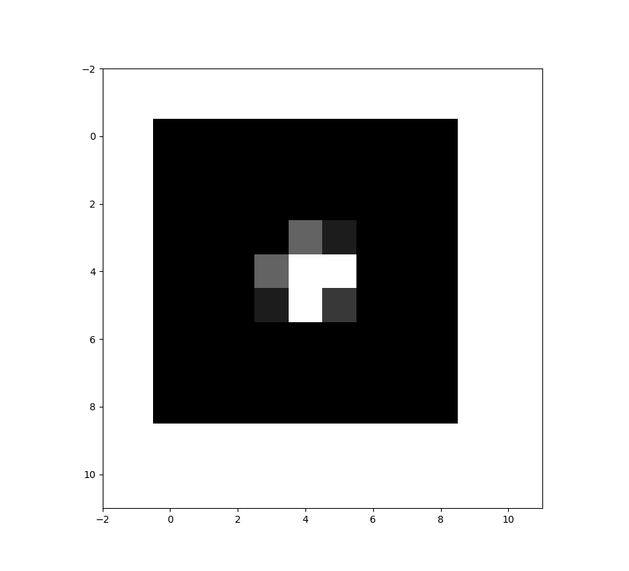

ConvNet
=======

## Caffe Similar Achitecture in Pure Python for Scientific Research

The project implements some of core components of neural network and provides
test programs from different angles.

Before 2014, many researchers were interested in high level optimization solution for neural netowrk, such as fully connected neural network and convolutional neural network.

As the neural netowrk envolves into a dynamic computing graph, different operators were proposed from 2015 to 2017

Nowadays, more research work focuses on the construction of network with different backbones. This project gives us opportunities to rethink about core operators implemented in popular neural netowrk framework.

## An Usage Example

```python
bias = Vol(1, size1, init_gen=b)
inp = Vol(2, size2, init_gen=X)
convs = Vol(3, size3, init_gen=Theta)
conv_param = {'strip':2, 'pad':1}
conv_param['bias'] = bias

layer = ConvNet(X.shape[1:], convs, **conv_param)
vol_output = layer.forward(inp)
inp_grad, filters_grad, bias_grad = layer.bp(vol_output)
```

## Benchmark Test

> The benchmark borrows techniques from Numeric Computing Mathematics and utilizes utilities
provided by Stanford University

```text
/anaconda/bin/python /Applications/PyCharm.app/Contents/helpers/pydev/pydevd.py --multiproc --client 127.0.0.1 --port 49974 --file "/Users/wangyi/GitHub/yiak.github.io/Correlation Metrics/ConvNet/tests/test_conv_net.py"
/anaconda/lib/python2.7/site-packages/IPython/utils/traitlets.py:5: UserWarning: IPython.utils.traitlets has moved to a top-level traitlets package.
  warn("IPython.utils.traitlets has moved to a top-level traitlets package.")
pydev debugger: process 70855 is connecting

Connected to pydev debugger (build 139.1001)
2019-07-07 17:43:16,408 [INFO]:test_conv_net.py, ConvNet, in line 295 >> tests/test_conv_net.BatchNormTestCase Finish numeric computation with elapsed time 0.0188329219818
2019-07-07 17:43:16,408 [INFO]:test_conv_net.py, ConvNet, in line 306 >> tests/test_conv_net.BatchNormTestCase Finish BatchNorm.bp computation with elapsed time 0.000133037567139
2019-07-07 17:43:16,409 [INFO]:test_conv_net.py, ConvNet, in line 308 >> tests/test_conv_net.BatchNormTestCase Testing layer.bp(top_layer) inp_grad
2019-07-07 17:43:16,409 [INFO]:test_conv_net.py, ConvNet, in line 310 >> tests/test_conv_net.BatchNormTestCase Difference: 3.2186236349141194e-10
2019-07-07 17:43:16,409 [INFO]:test_conv_net.py, ConvNet, in line 313 >> tests/test_conv_net.BatchNormTestCase Testing layer.bp(top_layer) dW~Difference w.r.t. gamma
2019-07-07 17:43:16,409 [INFO]:test_conv_net.py, ConvNet, in line 315 >> tests/test_conv_net.BatchNormTestCase Difference: 2.770052941835114e-08
2019-07-07 17:43:16,410 [INFO]:test_conv_net.py, ConvNet, in line 318 >> tests/test_conv_net.BatchNormTestCase Testing layer.bp(top_layer) db~Difference w.r.t. beta
2019-07-07 17:43:16,410 [INFO]:test_conv_net.py, ConvNet, in line 320 >> tests/test_conv_net.BatchNormTestCase Difference: 3.275657729593016e-12
Successful with <BatchNormTestCase.test_bp>!

Successful with <BatchNormTestCase.test_forward>!

2019-07-07 17:43:29,999 [INFO]:test_conv_net.py, ConvNet, in line 142 >> tests/test_conv_net.ConvLayerTestCase Finish numeric computation with elapsed time 13.5871639252
2019-07-07 17:43:30,025 [INFO]:test_conv_net.py, ConvNet, in line 151 >> tests/test_conv_net.ConvLayerTestCase Finish ConvLayer.bp computation with elapsed time 0.00559186935425
2019-07-07 17:43:30,025 [INFO]:test_conv_net.py, ConvNet, in line 153 >> tests/test_conv_net.ConvLayerTestCase Testing layer.bp(top_layer) inp_grad
2019-07-07 17:43:30,025 [INFO]:test_conv_net.py, ConvNet, in line 155 >> tests/test_conv_net.ConvLayerTestCase Difference: 1.4249806831849532e-08
2019-07-07 17:43:30,026 [INFO]:test_conv_net.py, ConvNet, in line 158 >> tests/test_conv_net.ConvLayerTestCase Testing layer.bp(top_layer) filters_grad
2019-07-07 17:43:30,026 [INFO]:test_conv_net.py, ConvNet, in line 160 >> tests/test_conv_net.ConvLayerTestCase Difference: 6.165459855631704e-10
2019-07-07 17:43:30,026 [INFO]:test_conv_net.py, ConvNet, in line 163 >> tests/test_conv_net.ConvLayerTestCase Testing layer.bp(top_layer) bias_grad
2019-07-07 17:43:30,026 [INFO]:test_conv_net.py, ConvNet, in line 165 >> tests/test_conv_net.ConvLayerTestCase Difference: 5.1677473106768316e-11
Successful with <ConvLayerTestCase.test_bp>!

2019-07-07 17:43:30,029 [INFO]:test_conv_net.py, ConvNet, in line 83 >> tests/test_conv_net.ConvLayerTestCase I have trimmed the test data, hence, epilon as 1.0e-2 is correct. The original data can achieve 1.0e-6 precision
2019-07-07 17:43:30,029 [INFO]:test_conv_net.py, ConvNet, in line 84 >> tests/test_conv_net.ConvLayerTestCase Testing layer.forward
2019-07-07 17:43:30,030 [INFO]:test_conv_net.py, ConvNet, in line 86 >> tests/test_conv_net.ConvLayerTestCase Difference: 0.002288828337874726
Successful with <ConvLayerTestCase.test_forward>!

2019-07-07 17:43:47,510 [INFO]:test_conv_net.py, ConvNet, in line 207 >> tests/test_conv_net.ReluActivationTestCase Finish numeric computation with elapsed time 17.4793348312
2019-07-07 17:43:47,554 [INFO]:test_conv_net.py, ConvNet, in line 225 >> tests/test_conv_net.ReluActivationTestCase Finish stacked layer (ConvLayer -> ReluActivation).bp_all computation with elapsed time 0.0232589244843
2019-07-07 17:43:47,555 [INFO]:test_conv_net.py, ConvNet, in line 227 >> tests/test_conv_net.ReluActivationTestCase Testing layer.bp_all(top_layer) inp_grad
2019-07-07 17:43:47,555 [INFO]:test_conv_net.py, ConvNet, in line 229 >> tests/test_conv_net.ReluActivationTestCase Difference: 2.4689621312297805e-09
Successful with <ReluActivationTestCase.test_bp_all>!


----------------------------------------------------------------------
Ran 5 tests in 31.167s

OK

Process finished with exit code 0
```

## Sepical Operator Investigation

### Upsampling

    Upsampling is for resampling and interpolation of your input up to higher resolution. The terminology comes from Signal Processing. In convolution neural network, since maxpooling is non invertible, upsampling is an approximation of reverse operation of max pooling, which used commonly by the Feature Pyramid Network (FPN) backbone.

    FPN and ResNet50(101, 152, ...) form the foundation of the state of the art in the network architecture for features extraction in the realm of objects detection. FPN makes different scales of the same feature map and composes two stages of layers stacking method: bottom-up and top-down. It is top-down where we need `upsampling` from the smaller resolution feature map:

```text
        P_i = Add(Upsampling(P_{i+1}), Conv2D()(Ci)) 2<= i < 5
        P_5 = Conv2D()(C_5)
```

    There are several implementation for that purpose:

    - Unpooling: Unlike MaxPooling, Unpooling repeats nearest neighbor. From [keras documentation](https://github.com/keras-team/keras/blob/master/keras/layers/convolutional.py#L1974), we see that upsampling repeats rows and columns data by `factor`. As we can see from our tests, the operation loses details in the bigger resampled feature map.




    - Deconvolution: The key idea is that we can perform the reverse of convolution and preserve the connectivity to obtain the original
        input resolution. We have implemented convolution layer and we know that the input data could be updated using
        `transposed convolution`[1] if stride is close to 1 and `dilate`[2][3] for Bilinear Convolution Kernel[4][5].




        I compared it with commonly implementation by applying transpose of the bilinear kernel convolution



    - BilinearInterpolation: see [scikit-image implementation](https://scikit-image.org/docs/dev/api/skimage.transform.html#skimage.transform.rescale), it uses interpolation to upsample feature maps, and performs well both in details and overall effects.

    In this implementation, I provide you with additional methods and test codes used for unit tests. I also recommand you to read this article to understand it better:

    - http://warmspringwinds.github.io/tensorflow/tf-slim/2016/11/22/upsampling-and-image-segmentation-with-tensorflow-and-tf-slim/

    [Maximum Sampling Theorem](http://avisynth.nl/index.php/Resampling):

    - The sampling rate of samples should be double the maximum of frequences.

    This implementation will compute best upsampling rates and automatically inference sampling factor. The original upsampling factor
    corresponds to sampling frequency. By Maximum Sampling Theorem, we could derive a cheap size for convolution kernel maintaining
    the maximum information of original signals or feature maps.

    The terminology of factor may come from the [scikit-image implementaiton](https://github.com/scikit-image/scikit-image/blob/master/skimage/transform/_warps.py#L187),
    is the compression rate from an unsampled over its downsampled feature map.

    \[1\] https://www.tensorflow.org/api_docs/python/tf/nn/conv2d_transpose
    \[2\] https://datascience.stackexchange.com/questions/6107/what-are-deconvolutional-layers
    \[3\] https://github.com/yiakwy/conv_arithmetic
    \[4\] https://dsp.stackexchange.com/questions/53200/bilinear-interpolation-implemented-by-convolution
    \[5\] http://www.sfu.ca/~gchapman/e895/e895l11.pdf
